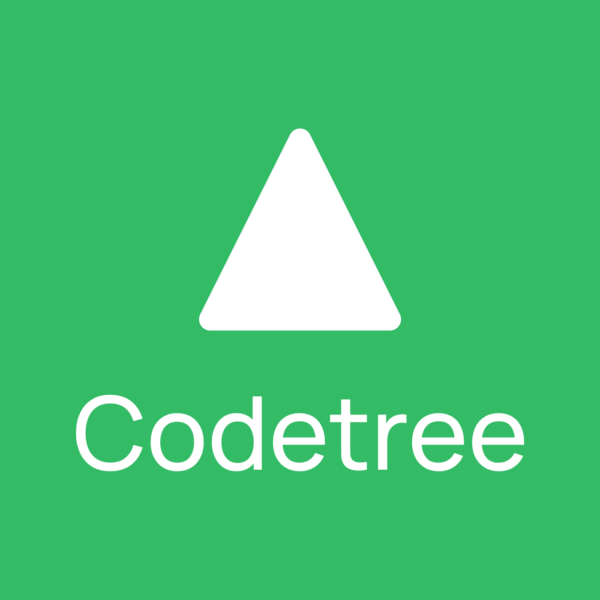
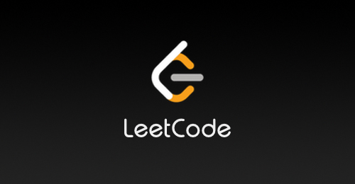

# 🧠 Algorithm Solutions
---

> 여러 알고리즘 플랫폼에서 풀이한 문제를 **하나의 레포지토리로 통합 관리**합니다.  
> 문제 수 · 최신 커밋 · 언어 통계 · 백준 티어는  
> **GitHub Actions 기반 자동 집계 시스템**으로 관리됩니다.

---

 

  

## 🌱 Contribution Graph

  

## 🏆 Baekjoon Tier: <!-- TIER:START --> **Gold V** <!-- TIER:END -->

## 🧩 Platforms

<table align="center">
<tr>
<td align="center" width="200">
<a href="./백준">
 
<b>Baekjoon</b>
</a>
</td>

<td align="center" width="200">
<a href="./프로그래머스">
 
<b>Programmers</b>
</a>
</td>

<td align="center" width="200">
<a href="./SWEA">
 
<b>SWEA</b>
</a>
</td>
</tr>
</table>

 

<table align="center">
<tr>
<td align="center" width="220">
<a href="./Codetree">
 
<b>Codetree</b>
</a>
</td>

<td align="center" width="220">
<a href="./Leetcode">
 
<b>LeetCode</b>
</a>
</td>
</tr>
</table>

# 📊 Problem Statistics

<!-- STATS:START -->
| Platform | Problems | Last Commit |
|---|---:|---|
| Baekjoon | 72 / 166 | 2026-02-25 |
| Programmers | 32 | 2026-01-27 |
| SWEA | 35 | 2026-02-24 |
| Codetree | 5 | 2026-02-28 |
| LeetCode | 20 | 2026-01-30 |
<!-- STATS:END -->

<!-- TOTAL:START -->
**Total Problems:** 164
<!-- TOTAL:END -->

---

> ⚠️ **Data Sync Notice**
> - 일부 Baekjoon 문제는 과거 업로드 이력 정리 중으로, 통계에 부분 반영되어 있습니다. (추후에 업데이트 예정에 있습니다.)
> - 집계 데이터는 GitHub Actions 스케줄 실행 시 순차적으로 보완됩니다.

---

## 🚀 Platform Progress

  

  

  

  

## 🧠 Language Distribution

<!-- LANG:START -->
- **Java**: 77.9%
- **Python**: 22.1%
<!-- LANG:END -->

---

## 🕒 Last Updated

<!-- UPDATED:START -->
🕒 Last Auto Update: 2026-03-01 23:57 KST
<!-- UPDATED:END -->

---

## ⚙️ Automation System

- 📌 Platform별 문제 수 자동 집계  
- 📌 각 디렉토리 최신 커밋 날짜 자동 반영  
- 📌 GitHub API 기반 언어 점유율 계산  
- 📌 solved.ac API 기반 백준 티어 자동 조회  
- 📌 매일 GitHub Actions 스케줄 실행  

README는  
**구조는 수동 관리, 수치는 자동 생성하는 deterministic 시스템**으로 동작합니다.
